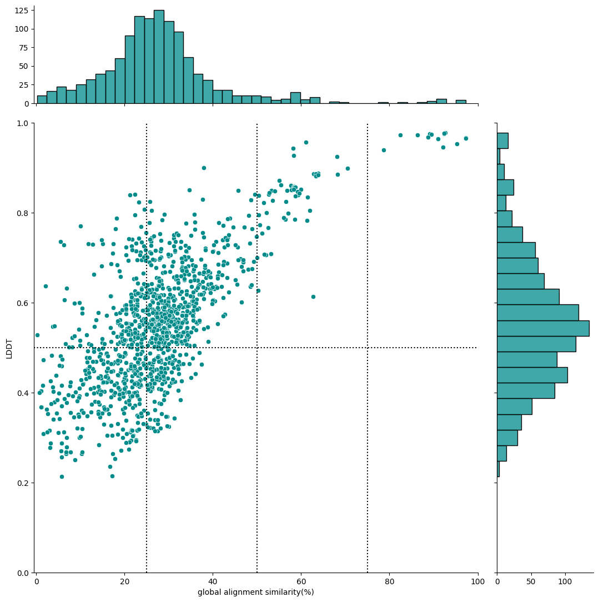

# plant2human workflow

This analysis workflow is centered on [foldseek](https://github.com/steineggerlab/foldseek), which enables fast structural similarity searches, and supports the discovery of understudied genes by comparing plants, which are distantly related species, with human, for which there is a wealth of information.
Based on the list of genes you are interested in, you can easily create a scatter plot of **“structural similarity vs. sequence similarity”** by retrieving structural data from the AlphaFold protein structure database.

&nbsp;

## Analysis environment

You can create an analysis environment using the [Dev Containers](./.devcontainer/devcontainer.json), which is one of VScode extensions.
Please check the official website for details.
- [VScode Dev Containers](https://code.visualstudio.com/docs/devcontainers/containers)

&nbsp;

## Example 1 ( *Oryza sativa* vs *Homo sapiens*)

Here, we will explain how to use the list of rice genes as an example.

### **1. Creation of a TSV file of gene and UniProt ID correspondences**

First, you will need the following gene list tsv file. (Please set the column name as "From")

```tsv
From
Os01g0187600
Os12g0129300
Os12g0159500
Os02g0609000
Os05g0468600
Os05g0352750
Os06g0140700
Os04g0391500
Os01g0795250
Os01g0859200
```

The following [TSV file](./test/oryza_sativa_test/rice_random_gene_idmapping_all.tsv) is required to execute the following workflow. 

```tsv
From	UniProt Accession
Os01g0187600	A0A0P0UZ77
Os12g0129300	A0A0P0Y6G7
Os12g0129300	B9GBP4
Os12g0159500	A0A0P0Y794
Os12g0159500	A0A8J8YJ44
Os12g0159500	B9GBZ8
...
```
To do this, you need to follow the CWL workflow command below.
This [yaml file](./job/uniprot_idmapping_job_example_os.yml) is the parameter file for the workflow for example.

```bash
cwltool --debug --outdir ./test/oryza_sativa_test ./Tools/01_uniprot_idmapping.cwl ./job/uniprot_idmapping_job_example_os.yml
```
In this execution, [mmcif files](./test/oryza_sativa_test/rice_random_gene_mmcif) are also retrieved.
The actual execution results are output together with the [jupyter notebook](./test/oryza_sativa_test/rice_random_gene_uniprot_idmapping.ipynb).

&nbsp;

### **2. Creating and preparing indexes**

I'm sorry, but the [main workflow](./Workflow/plant2human_v1.0.1.cwl) does not currently include the creation of an index (both for foldseek index and BLAST index).
Please perform the following processes in advance.

### 2-1. Creating a foldseek index

In this workflow, the target of the structural similarity search is specified as the AlphaFold database in order to perform comparisons across a wider range of species.
Index creation using the `foldseek databases` command is possible with [CWL Command Line Tool file](./Tools/02_foldseek_database.cwl).

Please select the database you want to use from `Alphafold/UniProt`, `Alphafold/UniProt50-minimal`, `Alphafold/UniProt50`, `Alphafold/Proteome`, `Alphafold/Swiss-Prot`.
You can check the details of this database using the following command.

```bash
docker run --rm quay.io/biocontainers/foldseek:9.427df8a--pl5321hb365157_1 foldseek databases --help
```

For example, if you want to specify AlphaFold/Swiss-Prot as the index, you can do so with the following command,

```bash
# using docker container
docker run -u $(id -u):$(id -g) --rm -v $(pwd):/home -e HOME=/home --workdir /home quay.io/biocontainers/foldseek:9.427df8a--pl5321hb365157_1 foldseek databases Alphafold/Swiss-Prot swissprot tmp --threads 8

# making directory
mkdir ./index/index_swissprot

# moving index file
mv swissprot* ./index/index_swissprot/
```
Note: We have written a [CWL file describing above process](./Tools/02_foldseek_database.cwl), but we have confirmed that an error occurs and are in the process of correcting it.

&nbsp;

### 2-2. Downloading a BLAST index file

An index FASTA file must be downloaded to obtain the amino acid sequence using the `blastdbcmd` command from the UniProt database.
In this case, since it is a rice and human comparison, it can be downloaded as follows.

```bash
# Oryza sativa (all uniprot entries)
curl -o uniprotkb_39947_all.fasta.gz "https://rest.uniprot.org/uniprotkb/stream?compressed=true&format=fasta&query=%28organism_id%3A39947%29"

gzip -d uniprotkb_39947_all.fasta.gz

# Homo sapiens (all uniprot entries)
curl -o uniprotkb_9606_all.fasta.gz "https://rest.uniprot.org/uniprotkb/stream?compressed=true&format=fasta&query=%28organism_id%3A9606%29"

gzip -d uniprotkb_9606_all.fasta.gz
```

&nbsp;

### 3. Execution of the [main workflow](./Workflow/plant2human_v1.0.1.cwl)

In this process, we perform a structural similarity search using `foldseek easy-search`, and then perform a pairwise alignment of the amino acid sequences of the hit pairs using `needle` and `water`.
Finally, we create a scatter plot based on this information and output a [jupyter notebook](./test/oryza_sativa_test/plant2human_report.ipynb) as a report.
Examples of commands are as follows.

```bash
cwltool --debug --outdir ./test/oryza_sativa_test ./Workflow/plant2human_v1.0.1.cwl ./job/plant2human_job_example_os.yml
```

&nbsp;

For example, you can visualize the results of structural similarity and global alignment, as shown below.


&nbsp;

The following scatter diagram can also be obtained from the test results of [Zey mays random 100 genes](./test/zea_mays_test).

